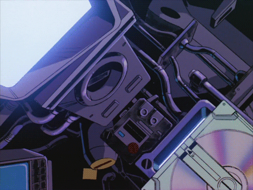

<h1 align="center">Hi 🤗, I'm Edoardo Piccari</h1>
<h3 align="center">🌌 Earth Observation Software Developer</h3>

  

  

  

## Favorite Software Libraries

  *  YoloV5
  *  OpenCV
  *  Tensorflow
  *  PySpark

## 🦉Connect with me 

## ⚜️Certification

* Salesforce Certified Platform Developer I (SP16)
* Salesforce Certified Administrator (SP16)
* Apache Spark - ELIS
* ROS for Beginners: Basics, Motion, and OpenCV - Udemy
* Python Course - AKT srl
* GDPR - Regolamento europeo (2016/679)
* Docker Mastery: with Kubernetes +Swarm from a Docker Captain - Udemy

<h3 align="left">Languages and Tools:</h3>

&nbsp;

